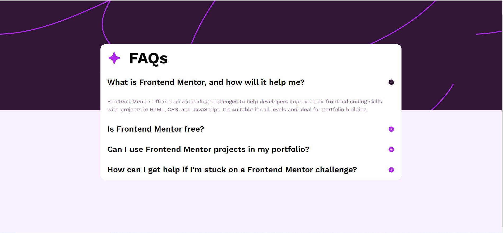

# Frontend Mentor - FAQ accordion solution

This is a solution to the [FAQ accordion challenge on Frontend Mentor](https://www.frontendmentor.io/challenges/faq-accordion-wyfFdeBwBz). Frontend Mentor challenges help you improve your coding skills by building realistic projects. 

## Table of contents

- [Overview](#overview)
  - [The challenge](#the-challenge)
  - [Screenshot](#screenshot)
  - [Links](#links)
- [My process](#my-process)
  - [Built with](#built-with)
  - [What I learned](#what-i-learned)
  - [Continued development](#continued-development)
  - [Useful resources](#useful-resources)
- [Author](#author)

## Overview

### The challenge

Users should be able to:

- Hide/Show the answer to a question when the question is clicked
- Navigate the questions and hide/show answers using keyboard navigation alone
- View the optimal layout for the interface depending on their device's screen size
- See hover and focus states for all interactive elements on the page

### Screenshot



### Links

- Solution URL: [Add solution URL here](https://www.frontendmentor.io/profile/DiegoIBH/solutions)
- Live Site URL: [Add live site URL here](https://diegoibh.github.io/frontendMentor-projects/)

## My process

### Built with

- Semantic HTML5 markup
- CSS custom properties
- Flexbox
- Bootstrap
- Sass
- Mobile-first workflow
- NPM (I used it but deleted the folder)

### What I learned

I used this exercise to practice a project with Bootstrap (customized with Sass). 
Also, wanted to feel more confortable using npm and construct a work envirnoment with specific dependencies to use for a faster production process (I deleted the node folder and extracted mini files for a optimized project).

```html
<!-- Used accordion selectors from bootstrap in order to faster produced a working accordion. Checked documentation ofr toggle interaction and where I can find variables in case there is the need of personlizing somthing -->
<div class="accordion-item">
        <h2 class="accordion-header">
          <button class="accordion-button" type="button" data-bs-toggle="collapse" data-bs-target="#collapseOne"
            aria-expanded="true" aria-controls="collapseOne">
            What is Frontend Mentor, and how will it help me?
          </button>
        </h2>
        <div id="collapseOne" class="accordion-collapse collapse show" data-bs-parent="#accordionExample">
          <div class="accordion-body">
            Frontend Mentor offers realistic coding challenges to help developers improve their
            frontend coding skills with projects in HTML, CSS, and JavaScript. It's suitable for
            all levels and ideal for portfolio building.
          </div>
        </div>
      </div>
<!-- Also, properly linking document for js functionalities and css compiling (from scss). Note: I used a Sass what extension, since I believe it's updates live and can see the changes of the comipled(mini) css file.

```
```scss
//Used customized bootstrap variables in order to change focus box-shadow color and opacity
$dark-purp: hsl(293, 82%, 45%);
$focus-ring-opacity:.50;
$primary: $dark-purp;

$focus-ring-width:      .25rem !default;

$focus-ring-color:      rgba($primary, $focus-ring-opacity) !default;
$focus-ring-blur:       0 !default;
$focus-ring-box-shadow: 0 0 $focus-ring-blur $focus-ring-width $focus-ring-color !default;

@import "../assets/sass/bootstrap.scss";
```

### Continued development

Below, there is my list of things to improve:

1. Set up a better workflow and envirnoment for the project.
2. Understand better how to configure a compiling json with out a extention like Live Sass Compiler.
3. Faster use of selectors in bootstrap and better understanding of it's variables.
4. Better understanding of how to use npm and how to use it in a better way.


### Useful resources

- [Bootstrap Accordion docs](https://getbootstrap.com/docs/5.3/components/accordion) - This helped me on understanding better the structure and its selectors. 
- [SCSS Variables docs](https://sass-lang.com/guide/#variables) - This is an amazing article which helped me finally understand XYZ. I'd recommend it to anyone still learning this concept.


## Author

- Website - [Diego Barros](https://diegoibh-curr.wuaze.com)
- Frontend Mentor - [@DiegoIBH](https://www.frontendmentor.io/profile/DiegoIBH)
- GitHub - [@DiegoIBH](https://github.com/DiegoIBH)

